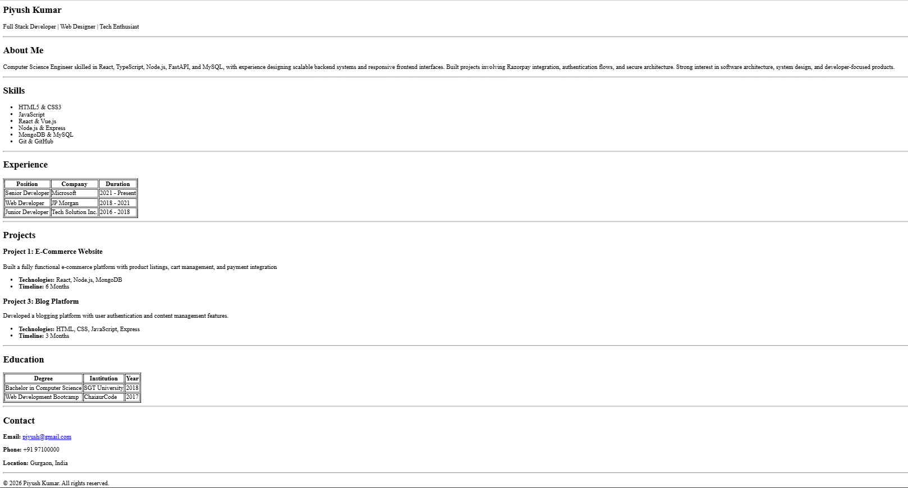

# HTML Resume Assignment

This project is a single-page resume website built using only HTML as part of an academic assignment.

The goal of the assignment is to practice clean HTML structure using proper tags such as headings, paragraphs, lists, tables, and semantic sections while matching a provided layout.

---

## Features

- Header with name and professional title  
- About Me section  
- Skills listed using unordered list  
- Experience displayed using table  
- Projects section with descriptions  
- Education details using table  
- Contact information  
- Clean and readable HTML structure  
- No CSS or JavaScript used (HTML only)

---

## Technologies Used

- HTML5 only

---

## How to Run This Project

1. Download or clone this repository  
2. Open the `index.html` file in any web browser (Chrome, Edge, Firefox, etc.)  
3. The resume will open as a single-page website

---

## Screenshot



## Live Demo

You can view the hosted website here:
<https://piyushkumar-20.github.io/Cohort-Assignment-/>

``` markdownlint
